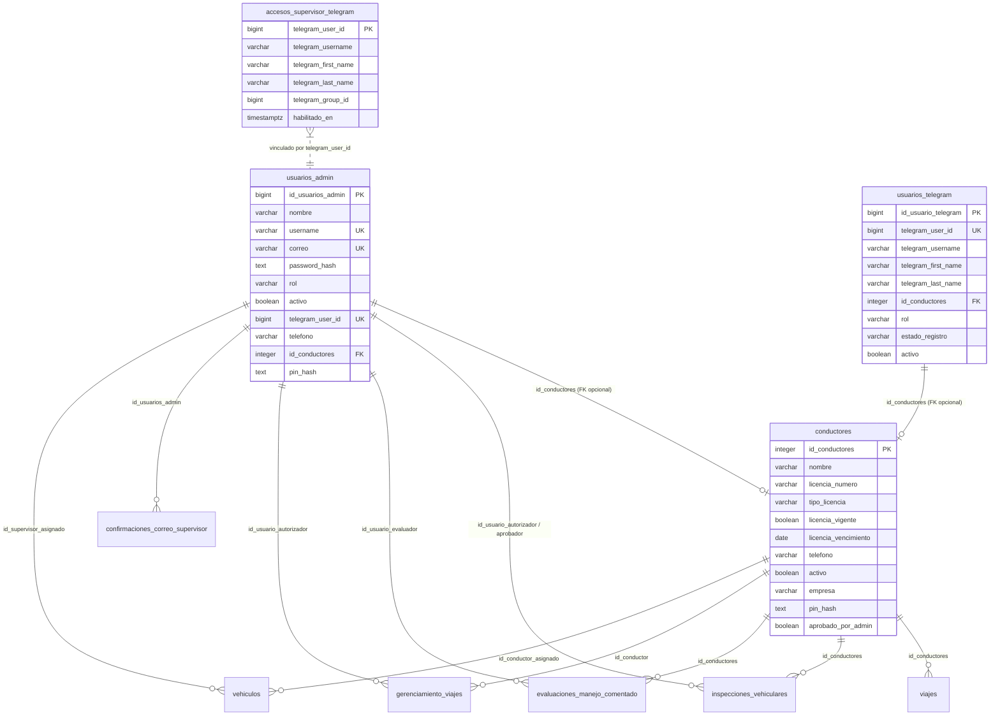
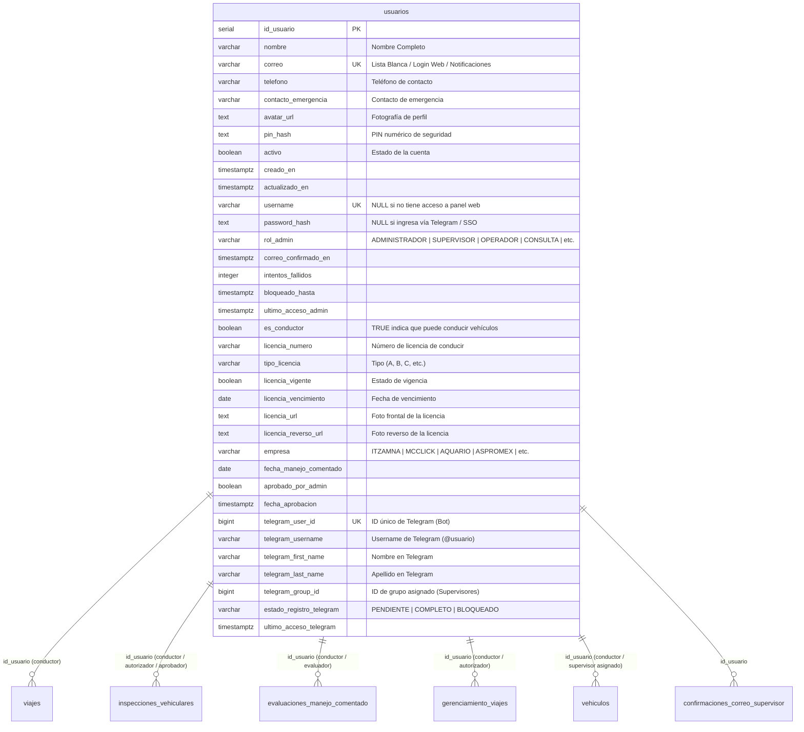

# Plan de Unificación del Modelo de Usuarios (Base de Datos y Sistema)

## Diagnóstico del Estado Actual en Producción (Servidor EC2)
Tras la inspección directa realizada mediante SSH en la base de datos `gerenciamiento_viajes_prod` (PostgreSQL 16 en EC2), se confirmó la presencia de 4 tablas independientes para gestionar personas/usuarios:

1. **`usuarios_admin`**: Usuarios del panel web administrativo (Administrador, Supervisor, Operador, Consulta, etc.).
2. **`conductores`**: Perfiles operativos asignados a vehículos, viajes e inspecciones.
3. **`usuarios_telegram`**: Cuentas registradas a través del Bot de Conductor de Telegram.
4. **`accesos_supervisor_telegram`**: Lista blanca y registro de supervisores para el Bot de Supervisores de Telegram.

### El Problema Operativo
Cuando un **Supervisor Administrativo** también se desempeña como **Conductor** de un vehículo:
- Debe crearse de forma duplicada en `usuarios_admin` y en `conductores`.
- Posee registros independientes en `usuarios_telegram` y en `accesos_supervisor_telegram`.
- Si se modifica su número telefónico, correo, nombre o estado de activación (`activo`), el cambio no se propaga automáticamente entre tablas, generando datos inconsistentes.

---

## 1. Diagrama Entidad-Relación: Estado Actual (4 Tablas Fragmentadas)

El siguiente diagrama refleja la arquitectura **actual** de la base de datos de producción con sus 4 tablas y sus relaciones con el resto del sistema:



---

## 2. Diagrama Entidad-Relación: Modelo Unificado Propuesto (Tabla Única `usuarios`)

En la arquitectura propuesta, se crea una **única tabla central `usuarios`** que consolida todos los atributos personales, administrativos, operativos y de Telegram. Un supervisor que conduce mantiene **un solo registro** con `es_conductor = TRUE` y `rol_admin = 'SUPERVISOR'`.



---

## 3. Definición de la Tabla Unificada `usuarios` (DDL SQL)

```sql
CREATE TABLE usuarios (
    -- 1. Identificación y Datos Personales Básicos
    id_usuario SERIAL PRIMARY KEY,
    nombre VARCHAR(150) NOT NULL,
    correo VARCHAR(200) UNIQUE,                  -- Email único para lista blanca / login / SSO
    telefono VARCHAR(30),
    avatar_url TEXT,
    contacto_emergencia VARCHAR(200),
    pin_hash TEXT,                                 -- PIN numérico de acceso (conductor / supervisor)
    activo BOOLEAN NOT NULL DEFAULT TRUE,
    creado_en TIMESTAMPTZ NOT NULL DEFAULT CURRENT_TIMESTAMP,
    actualizado_en TIMESTAMPTZ NOT NULL DEFAULT CURRENT_TIMESTAMP,

    -- 2. Credenciales y Acceso al Panel Web (Administrativo)
    username VARCHAR(100) UNIQUE,                 -- NULL si solo es Conductor sin acceso web
    password_hash TEXT,                            -- NULL si no ingresa con contraseña web
    rol_admin VARCHAR(30),                         -- 'ADMINISTRADOR', 'SUPERVISOR', 'OPERADOR', 'CONSULTA' (NULL si solo es Conductor)
    correo_confirmado_en TIMESTAMPTZ,
    intentos_fallidos INTEGER NOT NULL DEFAULT 0,
    bloqueado_hasta TIMESTAMPTZ,
    ultimo_acceso_admin TIMESTAMPTZ,

    -- 3. Perfil Conductor / Operativo
    es_conductor BOOLEAN NOT NULL DEFAULT FALSE,   -- TRUE indica que puede conducir/ser asignado a viajes
    licencia_numero VARCHAR(50),
    tipo_licencia VARCHAR(50),
    licencia_vigente BOOLEAN DEFAULT FALSE,
    licencia_vencimiento DATE,
    licencia_url TEXT,
    licencia_reverso_url TEXT,
    empresa VARCHAR(20),
    fecha_manejo_comentado DATE,
    aprobado_por_admin BOOLEAN DEFAULT TRUE,
    fecha_aprobacion TIMESTAMPTZ DEFAULT CURRENT_TIMESTAMP,

    -- 4. Integración Telegram (Bot Conductor y Bot Supervisor)
    telegram_user_id BIGINT UNIQUE,                -- ID de Telegram de la cuenta
    telegram_username VARCHAR(100),
    telegram_first_name VARCHAR(150),
    telegram_last_name VARCHAR(150),
    telegram_group_id BIGINT,                      -- ID del grupo de Telegram (supervisores)
    estado_registro_telegram VARCHAR(30) DEFAULT 'PENDIENTE',
    ultimo_acceso_telegram TIMESTAMPTZ,

    -- Restricciones de Dominio (Checks)
    CONSTRAINT chk_usuarios_empresa CHECK (
        empresa IS NULL OR (empresa IN ('ITZAMNA', 'MCCLICK', 'AQUARIO', 'ASPROMEX', 'BALAM', 'AGROKOOL'))
    ),
    CONSTRAINT chk_usuarios_rol_admin CHECK (
        rol_admin IS NULL OR rol_admin IN (
            'ADMINISTRADOR', 'SUPERVISOR', 'COORDINADOR', 'GERENTE', 'QHSE', 
            'OPERADOR', 'CONSULTA', 'INSTRUCTOR', 'COORDINADOR_AREA', 'GERENTE_GENERAL', 'COORDINADOR_QHSE'
        )
    ),
    CONSTRAINT chk_usuarios_estado_telegram CHECK (
        estado_registro_telegram IN ('PENDIENTE', 'PENDIENTE_APROBACION', 'COMPLETO', 'BLOQUEADO', 'RECHAZADO')
    )
);

-- Índices de alto rendimiento
CREATE INDEX idx_usuarios_es_conductor ON usuarios(es_conductor) WHERE es_conductor = TRUE;
CREATE INDEX idx_usuarios_rol_admin ON usuarios(rol_admin) WHERE rol_admin IS NOT NULL;
CREATE INDEX idx_usuarios_telegram_user_id ON usuarios(telegram_user_id) WHERE telegram_user_id IS NOT NULL;
CREATE INDEX idx_usuarios_correo ON usuarios(correo) WHERE correo IS NOT NULL;
CREATE INDEX idx_usuarios_activo ON usuarios(activo);
```

---

## 4. Matriz de Consolidación de Campos

| Campo en `usuarios` | Proviene de | Regla de Unificación / Integración |
| :--- | :--- | :--- |
| `id_usuario` | Nuevo `SERIAL PRIMARY KEY` | Llave primaria global que reemplaza `id_usuarios_admin` e `id_conductores`. |
| `nombre` | `conductores.nombre` / `usuarios_admin.nombre` | Si existe en ambas tablas para la misma persona, se conserva el de `usuarios_admin`. |
| `correo` | `usuarios_admin.correo` | Email único para lista blanca y autenticación. |
| `telefono` | `conductores.telefono` / `usuarios_admin.telefono` | Teléfono unificado. |
| `pin_hash` | `conductores.pin_hash` / `usuarios_admin.pin_hash` | Mismo PIN para la app móvil, bots y panel web. |
| `es_conductor` | Cálculo (`conductores.id_conductores IS NOT NULL`) | Banderola (`TRUE`/`FALSE`) que habilita las funciones operativas de conductor. |
| `rol_admin` | `usuarios_admin.rol` | Rol de permisos para el Panel Web (`SUPERVISOR`, `ADMINISTRADOR`, etc.). `NULL` para solo conductores. |
| `telegram_user_id` | `usuarios_telegram` / `usuarios_admin` / `accesos_supervisor_telegram` | ID único de Telegram consolidado. |
| `telegram_group_id` | `accesos_supervisor_telegram.telegram_group_id` | ID del grupo de supervisores de Telegram. |

---

## 5. Plan de Migración de Datos (Script SQL en Producción)

Para ejecutar la transición en el servidor de producción sin perder el historial operativo:

1. **Crear la tabla `usuarios`** y tablas temporales de mapeo (`temp_map_conductores`, `temp_map_admins`).
2. **Migrar `usuarios_admin`**:
   - Copiar todos los administradores/supervisores a `usuarios`.
   - Guardar la equivalencia `id_usuarios_admin` -> `id_usuario`.
3. **Migrar/Consolidar `conductores`**:
   - Para conductores vinculados previamente mediante `usuarios_admin.id_conductores` o por coincidencias de teléfono/nombre, actualizar la fila existente en `usuarios` poniendo `es_conductor = TRUE` y copiando los campos de licencia y empresa.
   - Para conductores que no existían en `usuarios_admin`, insertar una nueva fila con `es_conductor = TRUE` y `rol_admin = NULL`.
   - Guardar la equivalencia `id_conductores` -> `id_usuario`.
4. **Consolidar Telegram**:
   - Copiar `telegram_username`, `telegram_first_name`, `telegram_last_name`, `telegram_group_id` y `estado_registro_telegram` desde `usuarios_telegram` y `accesos_supervisor_telegram` hacia `usuarios`.
5. **Reasignar Claves Foráneas (FKs)**:
   - `viajes`: Cambiar `id_conductores` por `id_usuario`.
   - `inspecciones_vehiculares`: Cambiar `id_conductores`, `id_usuario_admin_aprobador` e `id_usuario_autorizador` por sus equivalentes en `id_usuario`.
   - `evaluaciones_manejo_comentado`: Cambiar `id_conductores` e `id_usuario_evaluador` por `id_usuario`.
   - `vehiculos`: Cambiar `id_conductor_asignado` e `id_supervisor_asignado` por `id_usuario`.
   - `gerenciamiento_viajes`: Cambiar `id_conductor` e `id_usuario_autorizador` por `id_usuario`.
   - `confirmaciones_correo_supervisor`: Cambiar `id_usuarios_admin` por `id_usuario`.
6. **Depuración**:
   - Renombrar las 4 tablas antiguas a `z_deprecated_*` como respaldo antes de su eliminación definitiva.

---

## 6. Impacto en el Código Backend y Frontend

### Backend (Node.js / Express)
- **Consultas de Conductores**: Cambiar de `SELECT * FROM conductores` a `SELECT * FROM usuarios WHERE es_conductor = TRUE`.
- **Consultas de Administrativos**: Cambiar de `SELECT * FROM usuarios_admin` a `SELECT * FROM usuarios WHERE rol_admin IS NOT NULL`.
- **Autenticación Bot Telegram**: Validar al usuario mediante `SELECT * FROM usuarios WHERE telegram_user_id = $1`. Si es supervisor, comprobar `rol_admin IN ('SUPERVISOR', 'ADMINISTRADOR')`. Si es conductor, comprobar `es_conductor = TRUE`.

### Panel Admin Web (React / Vite)
- Al crear/editar un usuario en el panel admin, se puede activar la casilla **"¿Es Conductor?"** y seleccionar su **"Rol Administrativo"** en el mismo formulario.
- En la pestaña de *Conductores*, si un Supervisor también es Conductor, aparecerá automáticamente sin necesidad de duplicarlo.

---

## Plan de Verificación

- **Verificación de Datos**: Comprobar que el número total de viajes, inspecciones y evaluaciones coincidan exactamente antes y después de migrar las llaves foráneas.
- **Verificación de Autenticación**: Probar inicio de sesión web en el Panel Admin y autenticación en los bots de Telegram.
- **Pruebas de Doble Rol**: Crear y editar un usuario que sea a la vez Supervisor y Conductor, verificando que una sola actualización se refleje en todo el sistema.
