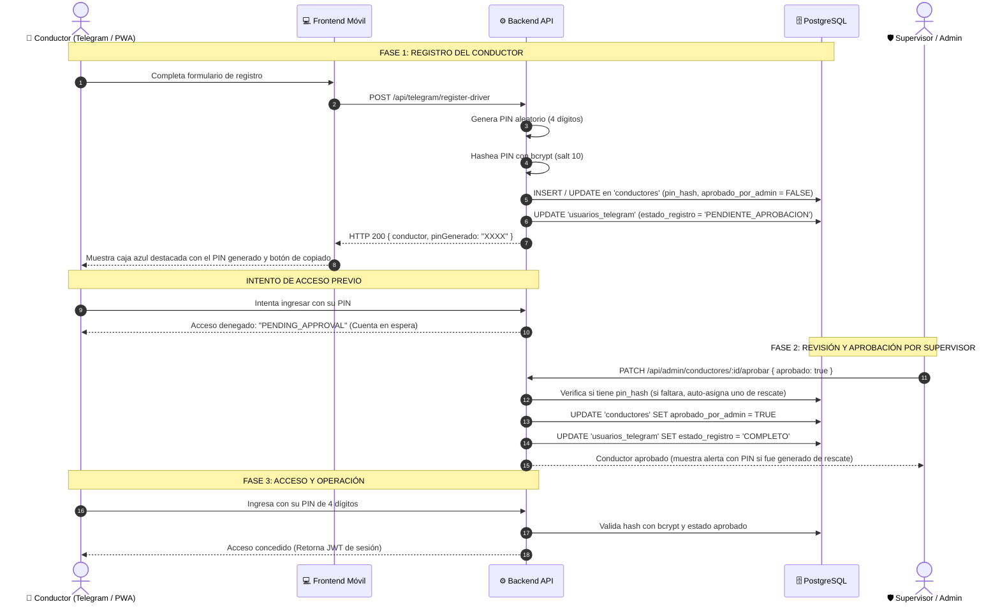

# 🚀 Flujo Unificado de PIN y Aprobación de Conductores

## 📋 Resumen Ejecutivo
Este documento describe la arquitectura, lógica de negocio, modelo de datos, interfaces y pruebas unitarias del **Flujo Unificado de Registro, Asignación de PIN y Aprobación de Conductores**, implementado para la plataforma **Gerenciamiento de Viajes (ASPROMEX)** en la rama `feature/AWS-deploy`.

El objetivo central de este desarrollo fue **eliminar la duplicidad y discrepancia de flujos** entre usuarios que se registraban vía Telegram Mini App, PWA o Panel Administrativo. Anteriormente, los usuarios de Telegram no recibían un PIN automático y requerían que el supervisor inventara y asignara uno manualmente. Con este nuevo flujo:
1. **El conductor siempre recibe su PIN de 4 dígitos en pantalla** inmediatamente al terminar el registro.
2. **El supervisor aprueba al conductor con un solo clic**, sin necesidad de inventar contraseñas.
3. **El supervisor conserva la potestad de generar un nuevo PIN** (de manera automática o manual) ante olvidos o solicitudes de soporte.

---

## 🔄 Diagrama de Flujo del Proceso



---

## 🧩 Componentes Modificados y Lógica Técnica

### 1. Backend

#### A. Servicio de Autenticación de Telegram (`backend/src/services/telegram-auth.service.js`)
- **Generación de PIN en Registro:** Al registrarse un conductor nuevo o existente, el sistema ejecuta:
  ```javascript
  const generatedPin = String(Math.floor(1000 + Math.random() * 9000));
  const pinHash = await bcrypt.hash(generatedPin, 10);
  ```
- **Upsert Idempotente:**
  - Si el conductor ya existía (por ID o por número de licencia), actualiza sus datos, genera un nuevo PIN y actualiza su `pin_hash`.
  - Si no existía, inserta el nuevo registro con `aprobado_por_admin = false`.
- **Retorno Obligatorio de `pinGenerado`:** El backend retorna `{ pinGenerado, conductor, telegramUser }` para que la pantalla móvil pueda desplegarlo.
- **Inclusión de Campos:** Se añadió `aprobado_por_admin` en las columnas devueltas (`conductorColumns`).

#### B. Servicio de Gestión Administrativa (`backend/src/services/admin-conductores.service.js`)
- **Aprobación Segura (`approveAdminDriver`):**
  - Si el conductor ya cuenta con `pin_hash`, la aprobación simplemente activa al conductor (`aprobado_por_admin = true`), manteniendo el PIN intacto.
  - Si el conductor es **legado** y no tenía `pin_hash` (`NULL`), el backend genera automáticamente un PIN de rescate, lo hashea y lo devuelve en `pinGenerado` para que el supervisor lo conozca.
- **Creación Directa (`createAdminDriver`):**
  - Cuando un administrador crea un conductor manualmente desde el panel web, el sistema le genera de forma automática su PIN de 4 dígitos y lo deja aprobado de inmediato (`aprobado_por_admin = true`, `tiene_pin = true`).

#### C. Servicio de Autenticación de Conductor (`backend/src/services/driver-auth.service.js`)
- **Control de Acceso (`authenticateDriverWithPin`):**
  - Si `aprobado_por_admin === false`, retorna `{ authenticated: false, reason: "PENDING_APPROVAL" }`.
  - Si `pin_hash` no coincide, retorna `{ authenticated: false, reason: "INVALID_PIN" }`.
  - Solo cuando el conductor está aprobado y el PIN es correcto, emite el token JWT de conductor.
- **Asignación / Cambio de PIN (`setDriverPin`):**
  - Valida estrictamente que el PIN sea de 4 dígitos numéricos (`/^\d{4}$/`).
  - Almacena el nuevo hash con `bcrypt.hash(cleanPin, 10)` e invalida el PIN anterior.

#### D. Controlador de Administración (`backend/src/controllers/admin-conductores.controller.js`)
- Endpoint `PATCH /admin/conductores/:idConductor/pin`:
  - Acepta en el body `{ autoGenerate: true }` para generar un PIN aleatorio automáticamente.
  - O `{ pin: "1234" }` para asignar un PIN específico ingresado por el supervisor.
  - Retorna `data.pinGenerado` en la respuesta HTTP.

---

### 2. Frontend de Registro (`frontend/src/components/RegistroConductor.jsx`)
- **Pantalla de Confirmación:**
  - Al completar el formulario, muestra una tarjeta destacada con fondo gradiente azul.
  - Contiene el PIN numérico de 4 dígitos en tipografía monospace de gran tamaño (`2rem`).
  - Incluye un botón interactivo **"Copiar PIN"** con feedback visual (**"¡PIN Copiado!"**) mediante la API `navigator.clipboard`.
  - Despliega advertencia clara al conductor: *«Por favor anota o copia este PIN. Lo requerirás para acceder al sistema una vez que tu cuenta sea aprobada por el supervisor.»*

---

### 3. Panel de Administración (`panel-admin/src/pages/ConductoresPage.jsx`)
- **Badge de Estado de PIN:**
  - `✓ PIN Activo` (Verde claro `#dcfce7`, texto `#15803d`) si `conductor.tiene_pin === true`.
  - `Sin PIN` (Rojo claro `#fee2e2`, texto `#b91c1c`) si aún no tiene PIN asignado.
- **Acción "Generar nuevo PIN":**
  - Al pulsar el botón, una ventana de diálogo pregunta al supervisor si desea **generar automáticamente** un PIN aleatorio o **ingresar uno manual**.
  - Si elige automático, el backend genera el código y el panel muestra un `alert` con el PIN resultante para compartirlo con el conductor.
- **Acción "Desactivar / Reactivar" (Admin, Gerente y Coordinador):**
  - **Permisos:** Habilitado para `ADMINISTRADOR`, `GERENTE`, `GERENTE_GENERAL`, `COORDINADOR`, `COORDINADOR_AREA` y `COORDINADOR_QHSE`.
  - **Acción en Tabla y Modal:** Si el conductor está activo, muestra botón `.danger-button` ("Desactivar"). Si está inactivo, muestra `.reactivate-button` ("✓ Reactivar").
  - **Protección:** No permite desactivar si el conductor tiene un viaje `EN_CURSO`.
  - **Efecto Inmediato:** Sincroniza `conductores.activo = false` y `usuarios_telegram.activo = false`. Bloquea inicios de sesión y viajes de inmediato sin eliminar su historial de viajes.
- **Acción "Eliminar":**
  - Exclusivo para el rol `ADMINISTRADOR`, eliminando permanentemente el registro tras confirmación.

---

## 🗃️ Modelo de Base de Datos y Migración 020

### 1. Columna `pin_hash` en `conductores`
```sql
ALTER TABLE conductores ADD COLUMN IF NOT EXISTS pin_hash VARCHAR(255);
```

### 2. Migración `020_expand_usuario_telegram_estados.sql`
**Motivo:** La migración original `002_usuarios_telegram.sql` restringía el campo `estado_registro` a únicamente tres valores: `('PENDIENTE', 'COMPLETO', 'BLOQUEADO')`.
Al implementarse el flujo de aprobación, el backend requería los estados `'PENDIENTE_APROBACION'` y `'RECHAZADO'`, lo que causaba un error `violates check constraint "chk_usuario_telegram_estado"` (código 23514).

**Contenido de la migración:**
```sql
BEGIN;

ALTER TABLE usuarios_telegram
  DROP CONSTRAINT IF EXISTS chk_usuario_telegram_estado;

ALTER TABLE usuarios_telegram
  ADD CONSTRAINT chk_usuario_telegram_estado
  CHECK (
    estado_registro IN (
      'PENDIENTE',
      'PENDIENTE_APROBACION',
      'COMPLETO',
      'BLOQUEADO',
      'RECHAZADO'
    )
  );

COMMIT;
```

---

## 🧪 Batería de Pruebas Unitarias y Simulación

El archivo de pruebas se ubica en [backend/src/tests/pin-and-approval-flow.test.js](file:///c:/Users/Soporte%20TI%20Junior/Pictures/Nueva%20carpeta%20(2)/backend/src/tests/pin-and-approval-flow.test.js).

### Casos Cubiertos y Verificados (100% Exitosos):

| # | Caso de Prueba | Descripción | Resultado |
|---|---|---|---|
| **1** | **Registro Inicial Telegram** | Genera PIN de 4 dígitos, almacena hash en BD, queda en espera (`aprobado = false`) y bloquea login anticipado con `PENDING_APPROVAL`. | ✅ **PASS** |
| **2** | **Re-registro de Conductor** | Conductor existente vuelve a registrarse: actualiza datos, genera un nuevo PIN, actualiza el hash y retorna el nuevo PIN. | ✅ **PASS** |
| **3** | **Aprobación sin alterar PIN** | Supervisor aprueba a un conductor que ya tenía PIN: se aprueba y se verifica que el hash original no sufre modificaciones. | ✅ **PASS** |
| **4** | **Aprobación de Conductor Legado** | Conductor legado con `pin_hash = NULL`: al ser aprobado, el backend le auto-asigna un PIN de 4 dígitos y valida login exitoso. | ✅ **PASS** |
| **5** | **Creación Directa en Panel Admin** | Administrador crea conductor desde el panel: se le auto-genera PIN, queda activo y aprobado de inmediato. | ✅ **PASS** |
| **6** | **Supervisor Regenera PIN** | Asignación de PIN manual (`setDriverPin`), revoca el PIN previo (falla login con PIN viejo) y valida acceso con el nuevo. | ✅ **PASS** |
| **7** | **Validaciones y Errores** | Rechazo de PINs de 3 dígitos, 5 dígitos, caracteres alfanuméricos y conductores inexistentes. | ✅ **PASS** |

### Ejecución de Pruebas:
```bash
# Ejecución dentro del contenedor de Backend
docker compose exec backend node --test src/tests/pin-and-approval-flow.test.js
```

---

## 🚀 Guía de Despliegue (Producción / AWS)

Cuando se desplieguen estos cambios en el servidor productivo o en AWS:

1. **Obtener últimos cambios en la rama:**
   ```bash
   git pull origin feature/AWS-deploy
   ```

2. **Aplicar la migración en la base de datos PostgreSQL:**
   ```bash
   # Opción A: A través de docker compose exec
   docker compose exec backend node -e "import('./src/database/pool.js').then(async ({databasePool}) => { await databasePool.query('ALTER TABLE usuarios_telegram DROP CONSTRAINT IF EXISTS chk_usuario_telegram_estado; ALTER TABLE usuarios_telegram ADD CONSTRAINT chk_usuario_telegram_estado CHECK (estado_registro IN (\'PENDIENTE\', \'PENDIENTE_APROBACION\', \'COMPLETO\', \'BLOQUEADO\', \'RECHAZADO\'));'); process.exit(0); })"
   
   # Opción B: Ejecutando el script de migraciones
   # \ir ../migrations/020_expand_usuario_telegram_estados.sql
   ```

3. **Reconstruir y levantar los contenedores:**
   ```bash
   docker compose up -d --build
   ```

4. **Verificar salud de los contenedores:**
   ```bash
   docker compose ps
   # Todos los servicios deben reportar estado (healthy)
   ```
