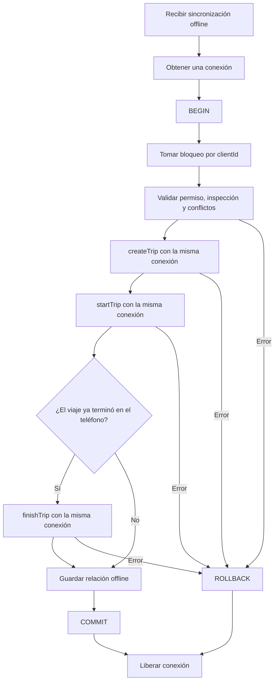

# Prevención de bloqueo del pool durante viajes offline

## Incidente comprobado

El 7 de octubre de 2026 una sincronización offline abrió una transacción y bloqueó
el conductor y el vehículo. Dentro de esa transacción, las operaciones de crear e
iniciar el viaje solicitaron otra conexión del pool. La nueva conexión quedó
esperando los bloqueos de la primera y la primera quedó esperando el resultado de
la nueva. Los reintentos ocuparon las 25 conexiones y el inicio por PIN empezó a
fallar por timeout.

## Solución implementada en local

1. `createTrip`, `startTrip` y `finishTrip` aceptan un cliente externo.
2. Cuando reciben ese cliente, no abren, confirman, revierten ni liberan otra
   transacción. La función que inició la transacción conserva su propiedad.
3. La sincronización offline pasa el mismo cliente a las tres operaciones.
4. Las horas de salida y llegada offline usan `startedAt` y `finishedAt` del
   dispositivo después de sus validaciones, en horario de Ciudad de México.
5. El pool cancela una consulta después de 30 segundos y una transacción inactiva
   después de 60 segundos. Esto limita el impacto si aparece otra fuga.
6. El preflight comprueba imports, sintaxis y pruebas antes de construir una imagen.

## Flujo transaccional esperado



## Verificación obligatoria antes de desplegar

Desde la raíz del proyecto:

```bash
bash scripts/preflight-backend-deploy.sh
```

Después del despliegue se debe comprobar:

```sql
SELECT state, wait_event_type, wait_event, count(*)
FROM pg_stat_activity
WHERE application_name LIKE 'gv-backend%'
GROUP BY state, wait_event_type, wait_event;
```

No deben acumularse conexiones `idle in transaction` ni esperas de tipo `Lock`.
El endpoint `/health` debe responder `200` y un PIN inválido debe responder un
error controlado `401`, nunca `500`.

## Regla de despliegue

La imagen debe construirse desde la misma carpeta fuente que se conserva como
versión desplegada. El comando `npm run verify:imports` debe ejecutarse antes del
build. Si falta cualquier módulo local, el despliegue se detiene y el contenedor
activo no debe reemplazarse.

## Viajes pendientes que cruzan de día

Un viaje de una fecha operativa anterior se cancela automáticamente únicamente
cuando continúa en `PENDIENTE` y `hora_salida` está vacía. La cancelación conserva
el viaje y su inspección como evidencia histórica y agrega el motivo en
`historial_estados_viaje`. Nunca se cancelan automáticamente viajes `EN_CURSO`,
finalizados ni registros que tengan hora de salida. La limpieza corre al iniciar
el backend, cada hora y antes de revisar conflictos al crear o sincronizar un viaje.
