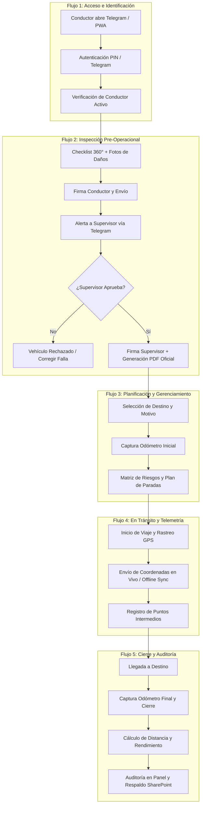

# Guía de Flujos de Trabajo y Estructura de Presentación
## Plataforma de Gerenciamiento de Viajes y Seguridad Operativa

**Destinatarios:** Usuarios Finales (Conductores, Supervisores, Administradores y Gerencia de Operaciones)  
**Fecha de Elaboración:** Septiembre 2026  
**Versión del Sistema:** 1.2.0

---

## 1. Resumen Ejecutivo y Actores del Sistema

El sistema **Gerenciamiento de Viajes** es una solución integral diseñada para digitalizar, controlar y respaldar la operación vehicular diaria, garantizando la seguridad del personal, la trazabilidad de las unidades y la eliminación del papel en los procesos pre y post viaje.

### Matriz de Roles y Responsabilidades

| Rol / Actor | Canal / Interfaz | Responsabilidades Clave |
| :--- | :--- | :--- |
| **Conductor / Operador** | Telegram Mini App / PWA Móvil | Autenticación, inspección pre-operacional 360°, registro de kilometraje inicial/final, ejecución de ruta con GPS y reporte de incidentes. |
| **Supervisor de Operaciones** | Bot de Telegram + Portal Web de Supervisión | Recepción de alertas instantáneas, validación y firma/rechazo de inspecciones vehiculares, autorización de planes de viaje y evaluaciones de manejo. |
| **Administrador / Control** | Panel Web Administrativo | Monitoreo de flota en mapa interactivo en tiempo real, auditoría de odómetros y combustible, gestión de catálogos y consulta de expedientes/PDFs sincronizados con SharePoint. |

---

## 2. Diagrama General de los Flujos de Trabajo (Workflows)



---

## 3. Detalle Operativo de los 6 Flujos de Trabajo

### Flujo 1: Acceso, Registro e Identidad Operativa
1. **Punto de Entrada:** El operador accede desde su teléfono móvil a través del bot de Telegram (`/start`) o abriendo el enlace directo en su navegador Chrome (PWA instalable).
2. **Validación:** El sistema valida la identidad (vía datos criptográficos de Telegram o PIN de acceso de 4 dígitos).
3. **Verificación de Perfil:** Se comprueba el estatus activo del conductor, su licencia de conducir vigente y el vehículo que tiene asignado.

### Flujo 2: Inspección Vehicular Pre-Operacional (Checklist 360°)
1. **Revisión Física:** Antes de encender la unidad, el operador completa el checklist diario (luces, niveles de aceite y refrigerante, frenos, neumáticos, kit de emergencia).
2. **Registro Visual de Daños:** Marcado interactivo sobre las vistas del vehículo (frontal, laterales, trasera) y carga de fotografías para documentar rayones o abolladuras previas.
3. **Firma Digital del Conductor:** Firma directamente en la pantalla táctil de su teléfono.
4. **Alerta y Aprobación del Supervisor:** El supervisor recibe una notificación en el grupo de Telegram con un enlace al portal de supervisión. Al revisar las evidencias, aprueba o rechaza el checklist y estampa su propia firma digital.
5. **Generación Documental:** El sistema genera un PDF firmado por ambas partes que avala la salida segura de la unidad.
6. **Regla de Negocio:** El checklist se reinicia automáticamente cada día a las 10:00 PM y es obligatorio por operador, garantizando la corresponsabilidad de quien toma el volante.

### Flujo 3: Planificación y Gerenciamiento del Viaje (Gestión de Riesgos)
1. **Configuración de la Salida:** Selección de lugar de origen, destino oficial, motivo del traslado y acompañantes.
2. **Registro de Odómetro Inicial:** Captura numérica del kilometraje del tablero y fotografía de respaldo.
3. **Matriz de Riesgo en Ruta:** Para trayectos foráneos o en carretera, se llenan los controles de seguridad:
   - Identificación de condiciones climáticas adversas o rutas de alto riesgo.
   - Planificación de paradas de descanso reglamentarias (cada 2 a 3 horas de manejo).
   - Definición de contactos y protocolos de auxilio.

### Flujo 4: Ejecución del Viaje y Trazabilidad GPS (Online / Offline)
1. **Inicio de Telemetría:** Al presionar "Iniciar Viaje", la aplicación activa el sensor GPS y comienza a reportar coordenadas de ruta en segundo plano.
2. **Capacidad Offline (Sin Cobertura Celular):** Si la unidad transita por carreteras o zonas serranas sin cobertura de red:
   - La aplicación almacena localmente todos los puntos GPS y eventos del viaje.
   - En cuanto el dispositivo recupera señal, sincroniza automáticamente los datos por lotes sin pérdida de información ni duplicados.
3. **Puntos Intermedios:** El conductor puede registrar paradas de descanso, carga de combustible o revisiones de caseta.

### Flujo 5: Finalización y Conciliación de Kilometraje
1. **Arribo:** Al llegar a su destino final, el conductor pulsa "Finalizar Viaje".
2. **Captura de Odómetro Final:** Se ingresa la lectura del odómetro de llegada.
3. **Cálculo y Validación Automática:**
   - La plataforma calcula el total de kilómetros recorridos y el tiempo efectivo de conducción.
   - Realiza validaciones cruzadas para evitar saltos de kilometraje respecto a lecturas anteriores.
   - Libera la unidad en el sistema para que quede disponible para el siguiente servicio.

### Flujo 6: Manejo Comentado, Reporte de Incidentes y Analítica
1. **Manejo Comentado (Seguridad Vial):** Los supervisores acompañan periódicamente a los conductores para evaluar sus hábitos de manejo defensivo (distancia de seguimiento, velocidad, uso de cinturón, concentración) y emiten una calificación con retroalimentación en PDF.
2. **Reporte Rápido de Siniestros:** En caso de avería mecánica, ponchadura o siniestro vial, el operador cuenta con un módulo de emergencia para remitir ubicación, fotos y descripción al centro de mando.
3. **Torre de Control (Panel Web):** Los administradores y la gerencia visualizan mapas interactivos con rutas históricas, auditoría de combustible y descargan expedientes con respaldo en la nube (Microsoft SharePoint).

---

## 4. Estructura Recomendada de la Presentación (12 Diapositivas)

Esta estructura está diseñada para una sesión explicativa de **25 a 35 minutos** dirigida a usuarios finales y mandos medios.

```
┌────────────────────────────────────────────────────────────────────────┐
│               ESTRUCTURA DE LA PRESENTACIÓN (12 SLIDES)                │
├─────────┬───────────────────────────────────┬──────────────────────────┤
│ Bloque  │ Diapositiva                       │ Objetivo Principal       │
├─────────┼───────────────────────────────────┼──────────────────────────┤
│ BLOQUE  │ 1. Portada y Propósito            │ Bienvenida y visión      │
│ 1: INTRO│ 2. ¿Por qué una nueva plataforma? │ Beneficios y objetivos   │
│         │ 3. Roles y Canales de Acceso      │ Quién usa qué            │
├─────────┼───────────────────────────────────┼──────────────────────────┤
│ BLOQUE  │ 4. Paso 1: Acceso e Identificación│ Ingreso ágil             │
│ 2: PASO │ 5. Paso 2: Inspección 360°        │ Seguridad pre-viaje      │
│ A PASO  │ 6. Paso 3: Aprobación Supervisor  │ Cadena de mando digital  │
│ OPERATIV│ 7. Paso 4: Gerenciamiento y Ruta  │ Prevención de riesgos    │
│         │ 8. Paso 5: En Ruta y Rastreo GPS  │ Modo online / offline    │
│         │ 9. Paso 6: Cierre y Kilometraje   │ Cierre de odómetro       │
├─────────┼───────────────────────────────────┼──────────────────────────┤
│ BLOQUE  │ 10. Manejo Comentado e Incidentes │ Mejora continua y auxilio│
│ 3: VALOR│ 11. Panel y Reportes Ejecutivos   │ Torre de control y PDFs  │
│ Y CIERRE│ 12. Preguntas y Resumen de Buenas │ Compromiso y adopción    │
│         │     Prácticas                     │                          │
└─────────┴───────────────────────────────────┴──────────────────────────┤
```

---

### Guion y Contenido Detallado por Diapositiva

#### Diapositiva 1: Portada y Presentación
* **Título:** Plataforma de Gerenciamiento de Viajes y Seguridad Operativa.
* **Subtítulo:** Digitalización, Trazabilidad en Tiempo Real y Control de Nuestra Flota.
* **Elementos Visuales:** Logotipos corporativos + mockup en perspectiva mostrando la app móvil en celular y el panel de control en laptop.
* **Idea Clave a Transmitir:** Presentamos una herramienta creada para facilitar el trabajo diario de los conductores y garantizar que cada viaje sea seguro y documentado.

#### Diapositiva 2: ¿Por qué esta plataforma? Beneficios Clave
* **Título:** Modernización y Seguridad para Todos
* **Puntos a Exponer:**
  * **Cero Papel:** Eliminamos las carpetas físicas, bitácoras de papel y firmas manuales.
  * **Seguridad Mecánica:** Inspecciones pre-operacionales para asegurar que las unidades están al 100% antes de salir.
  * **Protección al Conductor:** Trazabilidad GPS y botón de reporte de siniestros ante cualquier percance.
  * **Claridad Operativa:** Registro exacto de distancias, mantenimientos y tiempos de traslado.

#### Diapositiva 3: ¿Quiénes participan en el sistema?
* **Título:** Ecosistema y Roles de Usuario
* **Contenido Gráfico:** Esquema de tres columnas:
  * **1. Conductor (Móvil):** Realiza inspecciones, inicia viajes, reporta odómetro y envía telemetría.
  * **2. Supervisor (Telegram + Portal Web):** Revisa checklists, autoriza salidas y realiza evaluaciones de manejo en ruta.
  * **3. Torre de Control / Gerencia (Panel Web):** Monitorea la flota en mapa interactivo, audita combustible y gestiona los catálogos.

#### Diapositiva 4: Paso 1 — Acceso Rápido y Perfil Operativo
* **Título:** Paso 1: Ingreso a la Aplicación
* **Puntos a Exponer:**
  * Acceso desde Telegram mediante comando `/start` o acceso directo en navegador Chrome del teléfono.
  * Autenticación segura mediante PIN de 4 dígitos o credenciales de operador.
  * Consulta del vehículo asignado y estatus de licencia de conducir.
* **Elementos Visuales:** Capturas de la pantalla de bienvenida y selector de PIN.

#### Diapositiva 5: Paso 2 — Inspección 360° (Checklist Pre-operacional)
* **Título:** Paso 2: Verificación de Seguridad del Vehículo
* **Puntos a Exponer:**
  * Checklist rápido de elementos críticos: frenos, luces, llantas, niveles y equipo de emergencia.
  * Diagrama interactivo de carrocería para marcar rayones o golpes existentes.
  * Adjuntar fotografías de evidencia y firma digital del operador en pantalla.
* **Elementos Visuales:** Captura del vehículo interactivo con marcas de daños y cuadro de firma digital.

#### Diapositiva 6: Paso 3 — Autorización Remota del Supervisor
* **Título:** Paso 3: Validación y Salida Autorizada
* **Puntos a Exponer:**
  * Notificación automática en el canal de supervisores en cuanto el operador envía su checklist.
  * El supervisor evalúa el reporte técnico en su portal móvil.
  * Aprobación con firma digital del supervisor: emisión del acta oficial en PDF y liberación de la unidad para el viaje.
* **Elementos Visuales:** Notificación en Telegram y PDF de inspección generado con ambas firmas.

#### Diapositiva 7: Paso 4 — Gerenciamiento del Viaje y Odómetro Inicial
* **Título:** Paso 4: Preparación y Plan de Ruta
* **Puntos a Exponer:**
  * Selección de destino oficial y motivo del traslado.
  * Captura del kilometraje de salida (odómetro inicial) y foto del odómetro.
  * Matriz de prevención de riesgos (paradas de descanso programadas, análisis de condiciones del camino).
* **Elementos Visuales:** Formulario de creación de viaje con campos de kilometraje y plan de descanso.

#### Diapositiva 8: Paso 5 — Durante el Viaje: Rastreo GPS y Modo Offline
* **Título:** Paso 5: En Ruta y Trazabilidad Satelital
* **Puntos a Exponer:**
  * Un clic en "Iniciar Viaje" comienza el registro continuo de coordenadas.
  * **¿Qué sucede si no hay señal celular en carretera?** El sistema entra en **Modo Offline**: guarda los puntos GPS en la memoria del teléfono y los transmite automáticamente en cuanto recupera cobertura.
  * Opción de registrar paradas intermedias de combustible o puntos de control.
* **Elementos Visuales:** Diagrama que ilustre el flujo "Con Señal (En Vivo) vs. Sin Señal (Caché Local $\rightarrow$ Sincronización Automática)".

#### Diapositiva 9: Paso 6 — Llegada a Destino y Cierre de Viaje
* **Título:** Paso 6: Fin del Recorrido y Conciliación
* **Puntos a Exponer:**
  * Confirmación de llegada al destino y clic en "Finalizar Viaje".
  * Captura del kilometraje final del tablero.
  * Cálculo instantáneo de kilómetros recorridos y liberación del vehículo en el sistema para la siguiente jornada.
* **Elementos Visuales:** Pantalla de resumen del viaje concluido con estadísticas de tiempo y distancia.

#### Diapositiva 10: Módulos Adicionales de Seguridad y Apoyo
* **Título:** Prevención y Atención Inmediata
* **Puntos a Exponer:**
  * **Reporte de Siniestros/Averías:** Botón de emergencia para enviar fotografías de fallas mecánicas, llantas ponchadas o accidentes al centro de monitoreo.
  * **Manejo Comentado:** Evaluaciones prácticas en ruta que fomentan el manejo defensivo y premian a los conductores con mejores hábitos de conducción.
* **Elementos Visuales:** Formulario de siniestros y ficha de evaluación de manejo.

#### Diapositiva 11: Torre de Control y Respaldo en la Nube (Supervisión y Gerencia)
* **Título:** Panel de Control Ejecutivo y Auditoría
* **Puntos a Exponer:**
  * Mapa en tiempo real con la ubicación de todas las unidades y trazado de rutas históricas.
  * Auditoría de odómetros y análisis de rendimiento de combustible por vehículo.
  * Respaldo y sincronización automática de actas y expedientes PDF en Microsoft SharePoint.
* **Elementos Visuales:** Captura del Dashboard administrativo con mapa de Leaflet, gráficas e indicadores de flota.

#### Diapositiva 12: Resumen, Buenas Prácticas y Sesión de Preguntas
* **Título:** Buenas Prácticas para una Operación Exitosa
* **Reglas de Oro para el Operador:**
  1. *Hacer la inspección a conciencia antes de encender el motor.*
  2. *Mantener encendido el GPS del celular durante todo el trayecto.*
  3. *Registrar con exactitud los números del odómetro de salida y llegada.*
* **Cierre:**
  * Contactos de soporte técnico y mesa de ayuda operativa.
  * Espacio abierto para preguntas, dudas y comentarios del equipo.

---

## 5. Recomendaciones Prácticas para la Capacitación

1. **Demostración en Vivo (3 a 5 minutos):** Durante la Diapositiva 5 y 6, proyectar en pantalla un celular haciendo una inspección real y mostrar cómo se recibe la alerta en Telegram de forma inmediata.
2. **Enfatizar el Comportamiento Sin Señal:** Tranquilizar a los operadores explicando que la aplicación no se traba ni pierde datos si viajan por zonas remotas sin señal celular.
3. **Entregar Ayuda Visual de Bolsillo:** Imprimir o enviar una infografía en imagen de 1 sola página con los 4 pasos clave del conductor: *1. Entrar $\rightarrow$ 2. Inspeccionar $\rightarrow$ 3. Iniciar Viaje con Odómetro $\rightarrow$ 4. Finalizar Viaje con Odómetro*.
